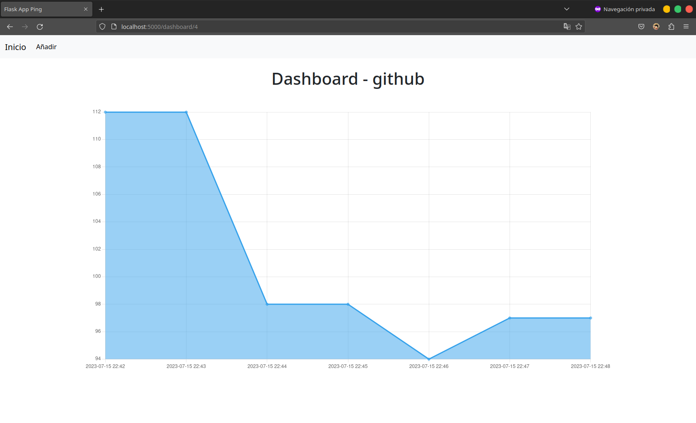
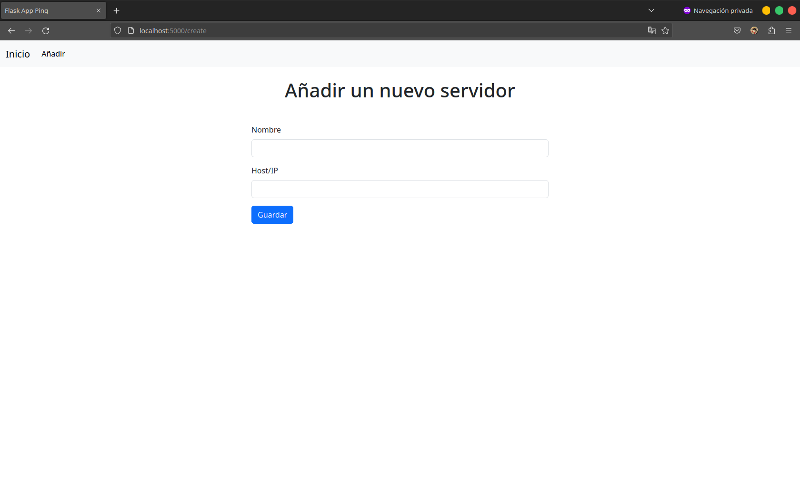
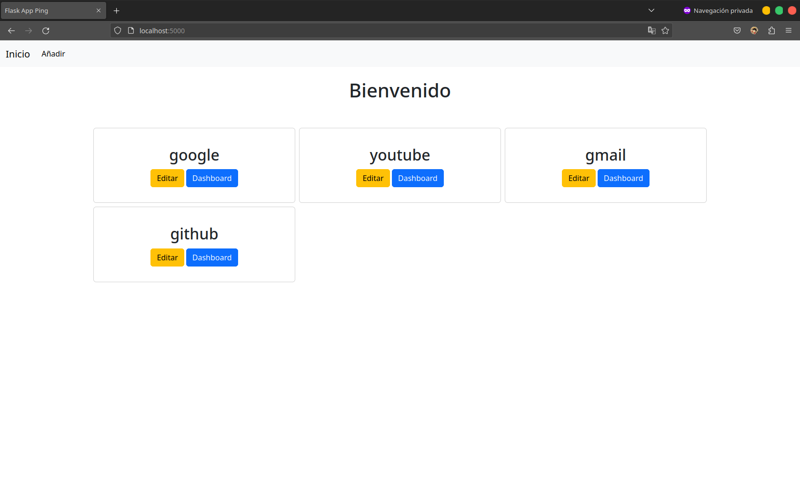
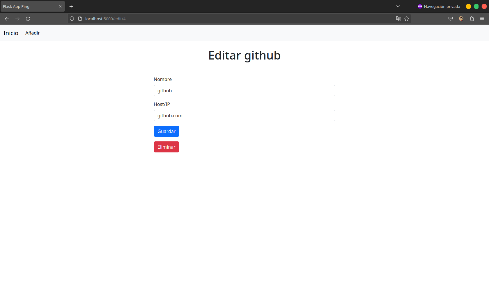
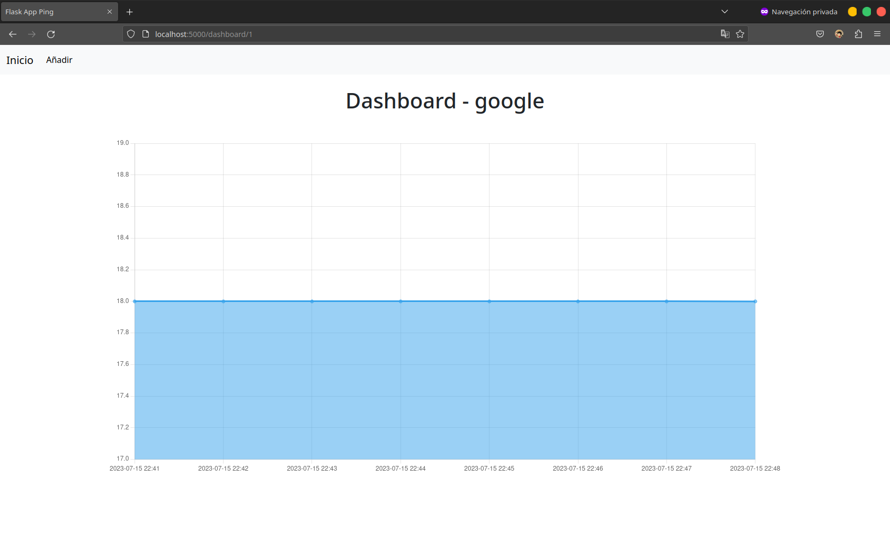

# flask-ping

Una aplicacion con interfaz sencilla para visualizar el tiempo de respuesta de servidores o sitios web.



[English](./README.md)

## Instalacion

Clone este repositorio.

```
git clone https://github.com/noe1sanji/flask-ping.git
```

Cree un entorno virtual e instale las dependencias.

```
cd flask-ping
python3 -m venv venv
source venv/bin/activate
pip install -r requirements.txt
```

Cree la base de datos.

```
flask init-db
```

Ejecute la aplicacion.

```
flask run
```

Ejecute el archivo cron.

```
python3 app/cron.py
```

Ingrese a `http://127.0.0.1:5000` y añada algunos servidores o sitios web para empezar a monitorear.

## Capturas de pantalla









