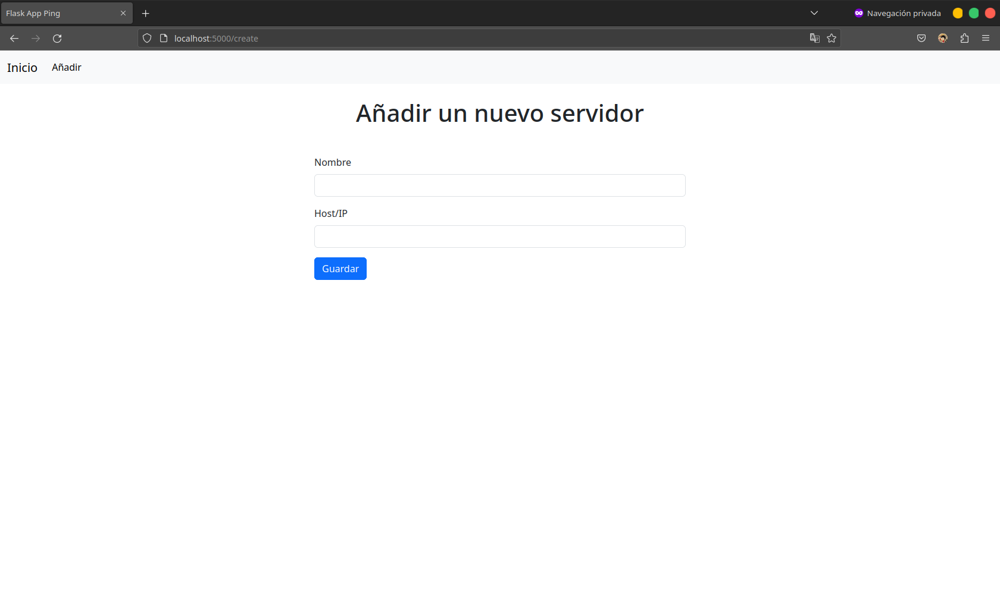
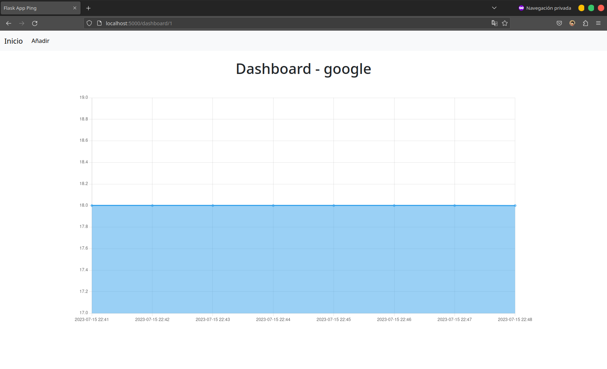

# flask-ping

An application with a simple interface to view the response time of servers or websites.


[Spanish](./README.ES.md)

## Install

Clone this repository.

```
git clone https://github.com/noe1sanji/flask-ping.git
```

Create a virtual environment and install the dependencies.

```
cd flask-ping
python3 -m venv venv
source venv/bin/activate
pip install -r requirements.txt
```

Create the database.

```
flask init-db
```

Run the application.

```
flask run
```

Run the cron file.

```
python3 app/cron.py
```

Enter `http://127.0.0.1:5000` and add some servers or websites to start monitoring.

## Screenshots





